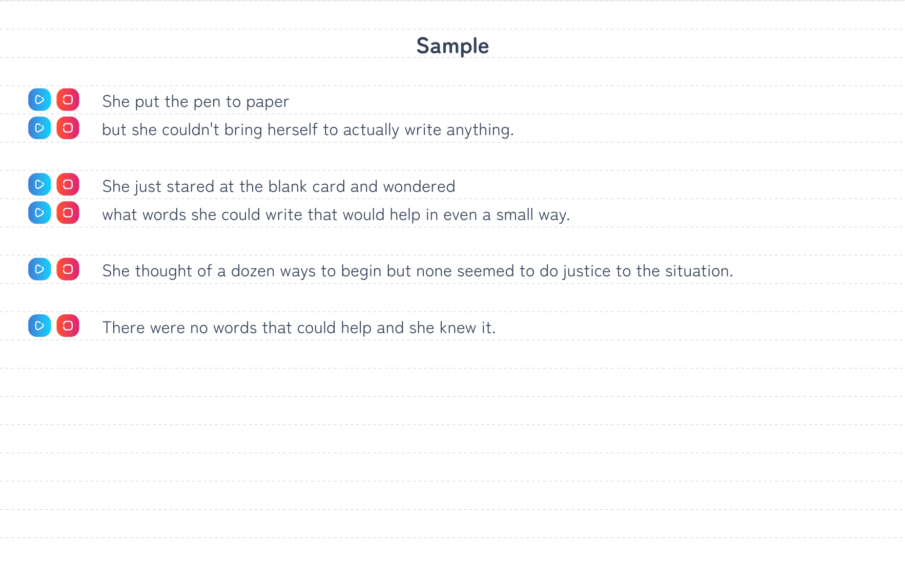

# English Audio Note

ブラウザで音読練習ができるデジタル英語ノート。

## 使い方

src/contents配下に後述する記法で英文コンテンツを記載したmdファイルを置くと、そのコンテンツの音読学習ページが作成されます。
著作権の関係上、contents配下は非公開です。以下に記載する方法で、コンテンツを追加してください。

### path

各学習ページには、`/note/(src/contents以下のパス)`でアクセスできます。

例えば、`src/contents/sample.md`の内容は、`http://localhost:3000/note/sample`ページに反映されます。

### frontmatter

`---`と`---`で囲まれた部分は、yaml形式で記述します。

- title
  - ページのタイトルとして表示される文字列
- sentence
  - 読み上げさせたい英文
    - 改行・空行はページでもそのまま表示されます。
    - 1行ごとにリピート再生機能が付与されます。

```
---
title: Sample
sentence: |
  She put the pen to paper 
  but she couldn't bring herself to actually write anything. 
  
  She just stared at the blank card and wondered 
  what words she could write that would help in even a small way. 
  
  She thought of a dozen ways to begin but none seemed to do justice to the situation. 
  
  There were no words that could help and she knew it.
---
```



## 追加予定の機能

- 速度調整
- スラッシュとかアクセントの位置とか書きこめる
  - それを見ながら音読練習
- 単語やフレーズの意味などのノートも兼ねる
- 日本語訳を見たり隠したり